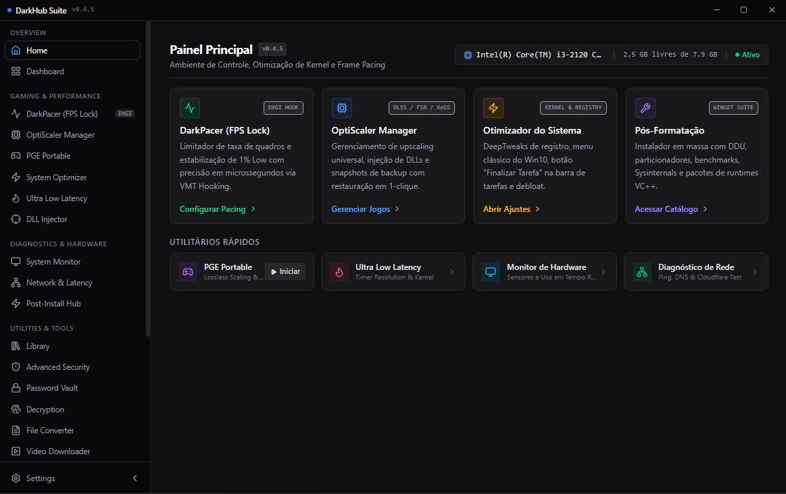

<p align="center">
  
</p>

<h1 align="center">DarkHub Suite</h1>

<p align="center">
  A high-performance modular Windows desktop utility for system configuration, gaming optimization, defensive security, media workflows, and offline tools.
</p>

<p align="center">
  <a href="https://github.com/Pokeralho/darkhub-suite/releases"></a>
  <a href="https://github.com/Pokeralho/darkhub-suite/blob/main/LICENSE"></a>
  
  
</p>

<p align="center">
  <a href="#quick-installation">Installation</a> •
  <a href="#overview">Overview</a> •
  <a href="#core-modules">Core Modules</a> •
  <a href="#architecture">Architecture</a> •
  <a href="#extensibility">Extensibility</a> •
  <a href="#building-from-source">Build</a> •
  <a href="#contributing">Contributing</a> •
  <a href="#license">License</a>
</p>

<p align="center">
  
</p>

---

## Quick Installation

Run the following command in **PowerShell (Administrator)**:

```powershell
irm darkhub.ink/win | iex
```

Direct GitHub repository installer:
```powershell
irm https://raw.githubusercontent.com/Pokeralho/darkhub-suite/main/install.ps1 | iex
```

---

## Overview

DarkHub Suite consolidates kernel-level Windows optimization, latency reduction engines, local defensive security, media processing, and offline utilities into a unified desktop interface built with Electron, React, and native C#/C++ background services.

All operations execute locally on the host machine. No user telemetry, telemetry payloads, or private data are transmitted to external servers.

---

## Core Modules

### 1. Steam Lua & Depot Tools Suite (Primary Feature)
- **Library & Manifest Management**: High-speed inspection, download, and installation of Steam `.lua` scripts, depot keys, and manifests with automatic `stplug-in` directory synchronization.
- **Steam Store CEF Bridge**: Automated Chromium Embedded Framework (CEF) debugging bridge injecting 1-click unlock and package download buttons directly into the official Steam Store client.
- **Online Fix (Spacewar 480)**: Native 1-click multiplayer redirection enabling online co-op and matchmaking through the Spacewar AppID.
- **Depot & DLC Granular Locking**: Per-depot version pin toggle (Manifest Lock) and auto-update toggle with visual configuration editor and raw Lua code editor.
- **Steam Auto-Restart & Hot Reload**: Instant client reloading with graceful termination and hot-swapped depot caches.

### 2. System Optimizer & Hardware Telemetry
- **Hardware Telemetry Engine**: Real-time polling of CPU frequency, per-core utilization, physical memory allocation, GPU load, storage health, and high-accuracy thermal sensors (Core Temp shared memory mapping and DTS thermal curves).
- **Software Uninstaller with Deep Leftovers Cleaner**: Runs official uninstallers and executes thorough heuristic scanning of residual traces in `%APPDATA%`, `%LOCALAPPDATA%`, `%PROGRAMDATA%`, and Windows Registry keys.
- **Advanced Network Stack Tuning**: Configures TCP NoDelay, multithreaded Receive Side Scaling (RSS 4 queues), MTU 1500, disables Energy Efficient Ethernet (EEE), and unlocks 100% QoS Psched bandwidth.
- **Process Scheduling Quanta & GPU Priority**: Configures `Win32PrioritySeparation` (0x26), CPU process scheduling priority, and DirectX `UserGpuPreferences` to force dedicated GPU execution.
- **Memory Management & RAM Cleaner**: 1-click working set flush, standby memory purge, and `DisablePagingExecutive` enforcement to maintain kernel-mode drivers in physical RAM.
- **Windows Debloat & Service Control**: 35+ fully reversible Windows registry and kernel tweaks with instant snapshot rollback (Undo).

### 3. DarkPacer & Low-Latency Gaming Engine
- **Hardware Frame Limiter**: Enforces ultra-stable frame pacing via high-resolution QueryPerformanceCounter (QPC) spin loops and driver integration.
- **Frametime Oscilloscope Overlay**: Real-time transparent DirectX overlay rendering frametime metrics, 1% low, 0.1% low, and frame variance.
- **Low-Level Native AutoClicker**: Dedicated C# background engine utilizing Win32 `SendInput` with `mouse_event` fallback for sub-millisecond precision, zero jitter, and global hotkeys (<kbd>F6</kbd>) functional in full-screen games.
- **Global Timer Resolution**: Enforces high-precision 0.5ms system timer resolution for input latency reduction.
- **OptiScaler Manager**: Detection, configuration, and injection of upscaling libraries (DLSS, FSR, XeSS) for supported titles.

### 4. Endpoint Defensive Security & Hardening
- **DNS Sinkhole (Hosts)**: Local filtering of tracking, telemetry, and malicious domains by routing queries to `0.0.0.0`.
- **URL Heuristic Analyzer**: Scans URLs for IDN homograph punycode attacks, typosquatting signatures, and credential harvester patterns.
- **Network Port Sentry**: Audits active TCP and UDP listening sockets with associated process identifiers and executable paths.
- **Windows Defender & SmartScreen Control**: Elevation engine managing Microsoft Defender and telemetry services via TrustedInstaller privileges.

### 5. Media Processing & YouTube Engine
- **YouTube and Media Downloader**: Multi-fragment media extraction powered by integrated yt-dlp and FFmpeg binaries.
- **Format and Codec Presets**: Direct export to MP3 (320 kbps), AAC, WAV, FLAC, and high-resolution video streams (up to 4K/2K/1080p).
- **Metadata and Cover Art Injection**: Automatic extraction and embedding of ID3 tags, artist/album metadata, and high-resolution album thumbnails.
- **Playlist Management**: Structured multi-track extraction with ordered index formatting and custom output directory routing.

### 6. Universal Offline Privacy & Productivity Tools
- **Universal Non-Destructive Metadata & Exif Editor**: Safe viewing, editing, and stripping of metadata across Images, Audio (`MP3, FLAC, WAV`), Video (`MP4, MKV, AVI`), and Documents (`PDF, DOCX`) using embedded ExifTool without stream re-encoding or corruption.
- **Offline OCR Text Extractor**: Offline text recognition supporting drag-and-drop, clipboard paste (<kbd>Ctrl+V</kbd>), Sharp preprocessing, and dual-language extraction (English + Portuguese).
- **Universal File Converter**: Local offline conversion between image, audio, video, and document formats.
- **Encrypted Password Vault**: Local credential repository utilizing AES-256-GCM encryption with master key derivation.

---

## Architecture

```
+------------------------------------------------------------------------+
|                        DarkHub Suite Architecture                      |
+-----------------------------------+------------------------------------+
|         Frontend (Renderer)       |         Backend (Electron/Main)    |
|  * React 19 + TypeScript + Vite 8 |  * Electron 41 (ESM)               |
|  * Tailwind CSS + Lucide Icons    |  * Node.js Runtime                 |
|  * Bilingual i18n Engine (EN/PT)  |  * Secure Preload & IPC Handlers   |
|  * Component Error Boundaries     |  * Hardware Abstraction Layer (HAL)|
+-----------------------------------+------------------------------------+
|                       Native Services & Binaries                       |
|  * DarkHub.FrameLimiter.exe (C#)      * DarkHub.LatencyEngine.exe (C#) |
|  * yt-dlp.exe (Media Extractor)       * ffmpeg.exe (Static Media Core) |
|  * OptiScaler DLL Bridge              * ExifTool Metadata Engine       |
+------------------------------------------------------------------------+
```

---

## Extensibility

### Custom Translations (i18n)
DarkHub Suite supports runtime internationalization:
1. Navigate to **Settings > Language > Collaborate / Import**.
2. Download the language template (`darkhub-i18n-template.json`).
3. Fill in translated strings for your target locale code.
4. Import the JSON file directly into the application.
5. Refer to [TRANSLATIONS.md](./TRANSLATIONS.md) for pull request guidelines.

### Community Threat Rules
1. Navigate to **Advanced Security > Community Rules**.
2. Download the threat indicators template.
3. Add verified domain blocks or heuristic patterns.
4. Import into the application or submit a Pull Request following [SECURITY_RULES.md](./SECURITY_RULES.md).

---

## Building from Source

### Prerequisites
- Node.js 20+ or 22+ LTS
- npm 10+
- Windows 10 or 11 (64-bit)
- .NET Framework 4.0+ (for native C# helper compilation)

### Build Instructions
```bash
# Clone the repository
git clone https://github.com/Pokeralho/darkhub-suite.git
cd darkhub-suite

# Install dependencies
npm install

# Run development mode
npm run dev

# Compile native services and renderer
npm run build:native
npm run build:renderer

# Package production installer
npm run build
```

The production NSIS installer will be generated at `dist_app/DarkHub Setup 0.4.5.exe`.

---

## Contributing

Contributions, bug reports, and optimizations are welcome. Please read [CONTRIBUTING.md](./CONTRIBUTING.md) before submitting pull requests.

---

## License

This project is licensed under the [MIT License](./LICENSE).
